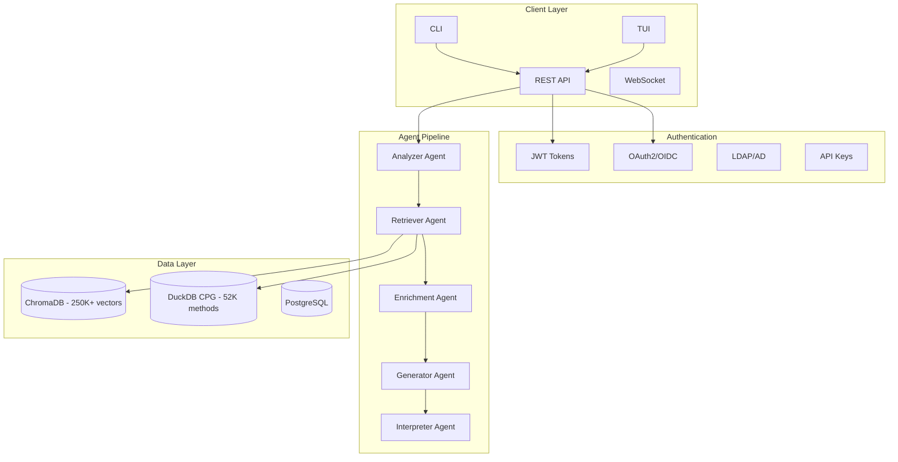

# CodeGraph: Hybrid Graph-Vector Code Analysis System


A production-ready code analysis system combining **semantic vector search** with **structural graph queries** to understand large codebases through natural language.

**Target Publication:** Tier-1 Software Engineering Venue (ICSE/FSE/ASE)

## Table of Contents

- [Key Features](#key-features)
- [Quick Start](#quick-start)
- [Architecture](#architecture)
- [Module Structure](#module-structure)
- [Workflow Scenarios](#workflow-scenarios)
- [Domain Plugin System](#domain-plugin-system)
- [API Reference](#api-reference)
- [Authentication](#authentication)
- [CLI and TUI](#cli-and-tui)
- [Configuration](#configuration)
- [Enterprise Security](#enterprise-security)
- [Project Statistics](#project-statistics)
- [Module Documentation](#module-documentation)
- [Documentation](#documentation)
- [License](#license)

## Key Features

### Hybrid Retrieval Engine
- Parallel async vector (ChromaDB) + graph (DuckDB) search
- RRF (Reciprocal Rank Fusion) merging for optimal ranking
- Sub-3ms average query latency with 90%+ memory reduction

### Multi-Domain Support
- PostgreSQL, Linux Kernel, LLVM, Python/Django, Generic C/C++
- Pluggable domain architecture with 51+ concepts per domain
- Switch domains with one config line

### 13 Specialized Agents
- Question analysis, retrieval, enrichment, generation, interpretation
- Call chain analyzer, adaptive refiner
- Fallback strategies with automatic recovery

### 16 Workflow Scenarios
- From codebase onboarding to security incident response
- Russian and English language support
- Real-time progress tracking via WebSocket

### Enterprise Security
- OAuth2 (GitHub, GitLab, Google, Keycloak)
- LDAP/Active Directory integration
- DLP (Data Loss Prevention) with pre/post request scanning
- SIEM integration (SysLog, CEF, LEEF formats)
- HashiCorp Vault for secrets management

### REST API + WebSocket
- FastAPI-based REST API with OpenAPI documentation
- Real-time chat via WebSocket
- Rate limiting, audit logging, background jobs

### Multiple LLM Providers
- GigaChat (Sber) - Russian language model
- Local (llama.cpp with Qwen3-Coder-30B)
- OpenAI-compatible APIs
- Yandex Cloud AI Studio (YandexGPT)

## Quick Start

### Prerequisites

- Python 3.11+
- Joern (for CPG generation) - [Installation Guide](docs/integrations/JOERN.md)
- PostgreSQL (optional, for API persistence)
- 16GB+ RAM recommended

### Option 1: Local Installation

```bash
# 1. Clone and setup environment
git clone <repository-url>
cd codegraph
conda create -n codegraph python=3.11
conda activate codegraph
pip install -r requirements.txt

# 2. Set environment variables
export GIGACHAT_AUTH_KEY="your-gigachat-key"
export JOERN_HOME="/path/to/joern"

# 3. Initialize vector stores
python scripts/init_vector_store.py

# 4. Run interactive demo
python demo_simple.py

# Example queries:
# - "Find method 'CommitTransaction'"
# - "What methods call 'AbortTransaction'?"
# - "Find SQL injection vulnerabilities"
```

### Option 2: Run API Server

```bash
# Start API server
uvicorn src.api.main:app --host 0.0.0.0 --port 8000

# API will be available at http://localhost:8000
# Interactive docs at http://localhost:8000/docs
```

### Option 3: Docker Compose

```bash
docker-compose up -d
# API available at http://localhost:8000
# TUI: docker exec -it codegraph-tui python -m src.tui.app
```

### Verify Installation

```bash
# Check system health
curl http://localhost:8000/api/v1/health

# Run test query
curl -X POST http://localhost:8000/api/v1/query \
  -H "Content-Type: application/json" \
  -d '{"query": "Where is heap_insert defined?"}'
```

See [Installation Guide](docs/getting-started/INSTALLATION.md) for detailed setup.

## Architecture

### High-Level Overview



### Agent Pipeline

```
User Question
    |
    v
+------------------+     +------------------+     +------------------+
|  Analyzer Agent  | --> | Retriever Agent  | --> | Enrichment Agent |
|  (Intent/Domain) |     | (Hybrid Search)  |     | (Semantic Tags)  |
+------------------+     +------------------+     +------------------+
                               |
              +----------------+----------------+
              |                                 |
              v                                 v
     +----------------+                +----------------+
     | Vector Search  |   PARALLEL     | Graph Search   |
     | (ChromaDB)     |   ========     | (DuckDB)       |
     | 250K documents |                | 52K methods    |
     +----------------+                +----------------+
              |                                 |
              +----------------+----------------+
                               |
                               v
                    +--------------------+
                    | RRF Merging        |
                    | Cross-Source Rank  |
                    +--------------------+
                               |
    +------------------+       |       +------------------+
    | Generator Agent  | <-----+-----> | Interpreter Agent|
    | (Query Gen)      |               | (Answer Synth)   |
    +------------------+               +------------------+
                               |
                               v
                    +--------------------+
                    |   Final Answer     |
                    | (with confidence)  |
                    +--------------------+
```

## Module Structure

The system consists of 34 specialized modules:

```
src/
├── agents/           # 13 specialized agents (analyzer, retriever, generator...)
├── analysis/         # Code analysis utilities and pattern matching
├── api/              # FastAPI REST + WebSocket API
├── architecture/     # Architecture violation detection
├── cli/              # Command-line interface
├── code_review/      # Automated code review with severity scoring
├── compliance/       # Compliance checking (coding standards)
├── config/           # Unified configuration management
├── cpg_export/       # Joern CPG -> DuckDB export pipeline
├── cross_repo/       # Cross-repository impact analysis
├── domains/          # Pluggable domain plugins (PostgreSQL, Linux, LLVM, Django)
├── evaluation/       # RAGAS evaluation framework
├── execution/        # Query execution and Joern client
├── extraction/       # Pattern extraction (CFG, DDG, comments)
├── generation/       # LLM-powered query generation
├── intent/           # Intent detection and classification
├── llm/              # LLM provider abstraction (GigaChat, local, OpenAI)
├── monitoring/       # Health checks and metrics
├── optimization/     # Query caching and performance optimization
├── patch_review/     # Git patch/PR review integration
├── performance/      # Performance analysis patterns
├── project_import/   # Universal project import pipeline
├── prompts/          # Prompt registry and templates
├── ranking/          # Result ranking and RRF fusion
├── refactoring/      # Refactoring assistance
├── retrieval/        # Vector stores (ChromaDB) and hybrid retrieval
├── security/         # Security scanning, DLP, SIEM integration
├── security_incident/# Security incident response workflows
├── services/         # Core business services (CPGQueryService)
├── tech_debt/        # Technical debt quantification
├── tui/              # Terminal UI (Rich-based)
├── utils/            # Utilities and helpers
├── validation/       # Query and tag validation
└── workflow/         # 16 scenario workflows orchestration
```

## Workflow Scenarios

The system provides 16 specialized workflow scenarios:

| # | Scenario | Description | Example Query |
|---|----------|-------------|---------------|
| 1 | `onboarding` | Codebase navigation | "Where is heap_insert defined?" |
| 2 | `security` | Vulnerability detection | "Find SQL injection vulnerabilities" |
| 3 | `security_incident` | Incident response | "Trace data flow from this vulnerability" |
| 4 | `performance` | Performance analysis | "Find functions with high complexity" |
| 5 | `documentation` | Doc generation | "Document the transaction subsystem" |
| 6 | `architecture` | Architecture analysis | "Find circular dependencies" |
| 7 | `refactoring` | Refactoring assistance | "Find dead code" |
| 8 | `mass_refactoring` | Bulk code changes | "Rename all instances of ExecProcNode" |
| 9 | `code_review` | Automated review | "Review this patch for breaking changes" |
| 10 | `compliance` | Standards checking | "Check coding style violations" |
| 11 | `tech_debt` | Debt quantification | "Find all TODO comments" |
| 12 | `cross_repo` | Cross-repo impact | "Which extensions depend on this function?" |
| 13 | `debugging` | Debug support | "Where should I set breakpoints?" |
| 14 | `feature_dev` | Feature development | "Where should I add a new join algorithm?" |
| 15 | `test_coverage` | Coverage analysis | "Generate unit tests for heap_insert" |
| 16 | `concurrency` | Concurrency patterns | "Analyze lock acquisition patterns" |

See [Scenarios Guide](docs/guides/SCENARIOS.md) for detailed examples.

## Domain Plugin System

The system uses a **pluggable domain architecture** that separates codebase-specific knowledge from core analysis logic.

### Supported Domains

| Domain | Description | Key Functions |
|--------|-------------|---------------|
| **PostgreSQL** | Database server analysis | `palloc`, `LWLockAcquire`, `ereport`, `SPI_execute` |
| **Linux Kernel** | Kernel code analysis | `kmalloc`, `spin_lock`, `printk` |
| **LLVM** | Compiler infrastructure | `CreateAlloca`, `IRBuilder` |
| **Python/Django** | Web framework analysis | `Model`, `View`, `ORM queries` |
| **Generic C/C++** | Any C/C++ codebase | Standard library patterns |

### Plugin Capabilities

```python
# Memory management functions
plugin.get_memory_functions()      # {'allocation': [...], 'deallocation': [...]}

# Synchronization primitives
plugin.get_concurrency_functions() # {'lwlock': [...], 'spinlock': [...], 'atomic': [...]}

# Security analysis
plugin.get_vulnerability_function_mappings()  # {'sql_injection': [...], 'buffer_overflow': [...]}
plugin.get_taint_sources()         # User input functions
plugin.get_taint_sinks()           # Dangerous operations
```

### Switching Domains

```yaml
# config.yaml
domain:
  name: postgresql  # or: linux_kernel, llvm, django, generic_cpp
```

See [Domain Plugin Guide](docs/development/DOMAIN_PLUGINS.md) for creating custom plugins.

## API Reference

### REST Endpoints

| Group | Method | Endpoint | Description |
|-------|--------|----------|-------------|
| **Auth** | POST | `/api/v1/auth/login` | User login |
| | POST | `/api/v1/auth/register` | User registration |
| | POST | `/api/v1/auth/refresh` | Refresh access token |
| | POST | `/api/v1/auth/oauth/{provider}` | OAuth2 login |
| | GET | `/api/v1/auth/me` | Current user info |
| **Query** | POST | `/api/v1/query` | Natural language query |
| | POST | `/api/v1/query/cpgql` | Raw CPGQL query |
| **Scenarios** | GET | `/api/v1/scenarios` | List scenarios |
| | POST | `/api/v1/scenarios/{id}/query` | Execute scenario |
| **Chat** | POST | `/api/v1/chat` | Chat message |
| | POST | `/api/v1/chat/stream` | Streaming chat |
| **Health** | GET | `/api/v1/health` | Full health check |
| | GET | `/api/v1/health/live` | Liveness probe |
| | GET | `/api/v1/health/ready` | Readiness probe |
| **Review** | POST | `/api/v1/review/analyze` | Analyze code/patch |
| **Projects** | GET | `/api/v1/projects` | List projects |
| | POST | `/api/v1/projects/import` | Import new project |

### WebSocket Endpoints

| Endpoint | Description |
|----------|-------------|
| `/api/v1/ws/chat` | Real-time chat with streaming |
| `/api/v1/ws/jobs/{job_id}` | Job progress updates |
| `/api/v1/ws/notifications` | Push notifications |

### Example Usage

```bash
# Login
curl -X POST http://localhost:8000/api/v1/auth/login \
  -H "Content-Type: application/json" \
  -d '{"username": "user", "password": "pass"}'

# Query with token
curl -X POST http://localhost:8000/api/v1/query \
  -H "Authorization: Bearer <token>" \
  -H "Content-Type: application/json" \
  -d '{"query": "Where is heap_insert defined?", "language": "en"}'

# Run security scenario
curl -X POST http://localhost:8000/api/v1/scenarios/security/query \
  -H "Authorization: Bearer <token>" \
  -H "Content-Type: application/json" \
  -d '{"query": "Find SQL injection vulnerabilities"}'
```

See [API Reference](docs/reference/API.md) for complete documentation.

## Authentication

### Supported Methods

| Method | Description |
|--------|-------------|
| **JWT** | Username/password login with access/refresh tokens |
| **API Keys** | Header-based authentication (`X-API-Key`) |
| **OAuth2** | GitHub, GitLab, Google, Keycloak |
| **LDAP** | Active Directory integration |

### JWT Authentication

```bash
# Login to get tokens
POST /api/v1/auth/login
{"username": "user", "password": "pass"}

# Response
{"access_token": "...", "refresh_token": "...", "token_type": "bearer"}

# Use token in requests
Authorization: Bearer <access_token>
```

### API Key Authentication

```bash
curl -H "X-API-Key: your-api-key" http://localhost:8000/api/v1/query
```

### LDAP Configuration

```yaml
api:
  auth:
    ldap:
      enabled: true
      server: ldap://ad.company.com:389
      base_dn: DC=company,DC=com
      role_mapping:
        "CN=Admins,OU=Groups,DC=company,DC=com": "admin"
        "CN=Analysts,OU=Groups,DC=company,DC=com": "analyst"
```

## CLI and TUI

### Command-Line Interface

```bash
# Query commands
python -m src.cli query "Where is heap_insert defined?"
python -m src.cli scenario security "Find SQL injection vulnerabilities"
python -m src.cli cpgql 'cpg.method.name("heap_insert").l'

# Project management
python -m src.cli projects list
python -m src.cli import /path/to/source --language c

# Admin commands
python -m src.cli health
python -m src.cli cache clear
```

### Terminal UI (TUI)

```bash
# Start TUI
python -m src.tui.app

# With theme
python -m src.tui.app --theme dark
```

**Keyboard Shortcuts:**
- `Ctrl+C` - Cancel query
- `Tab` - Switch panels
- `F1-F16` - Quick scenario select
- `Ctrl+Q` - Quit

See [CLI Guide](docs/guides/CLI_USAGE.md) and [TUI Guide](docs/TUI_GUIDE.md).

## Configuration

### Main Configuration File

```yaml
# config.yaml

# Domain selection
domain:
  name: postgresql  # postgresql, linux_kernel, llvm, django, generic_cpp

# LLM Provider
llm:
  provider: gigachat  # gigachat, local, openai, yandex
  gigachat:
    model: GigaChat-2-Pro
    temperature: 0.7

# Joern CPG Settings
joern:
  endpoint: localhost:8080
  cpg_path: workspace/pg17_full.cpg

# Retrieval Settings
retrieval:
  embedding_model: all-MiniLM-L6-v2
  top_k_qa: 3
  top_k_cpgql: 5

# API Server
api:
  host: 0.0.0.0
  port: 8000
  workers: 4
```

### Environment Variables

| Variable | Description |
|----------|-------------|
| `GIGACHAT_AUTH_KEY` | GigaChat API key |
| `JOERN_HOME` | Joern installation path |
| `DATABASE_URL` | PostgreSQL connection string |
| `API_JWT_SECRET` | JWT secret (64+ chars recommended) |
| `OAUTH_GITHUB_CLIENT_ID` | GitHub OAuth client ID |
| `OAUTH_GITHUB_CLIENT_SECRET` | GitHub OAuth client secret |
| `YANDEX_API_KEY` | Yandex Cloud API key |
| `YANDEX_FOLDER_ID` | Yandex Cloud folder ID |
| `LDAP_SERVER` | LDAP server URL |
| `LDAP_BASE_DN` | LDAP base DN |

See [Configuration Guide](docs/getting-started/CONFIGURATION.md) for all options.

## Enterprise Security

### DLP (Data Loss Prevention)

```yaml
security:
  dlp:
    enabled: true
    pre_request:
      enabled: true
      default_action: "WARN"  # BLOCK, MASK, WARN, LOG_ONLY
    categories:
      credentials:
        action: "BLOCK"
        severity: "critical"
      pii:
        action: "MASK"
        severity: "high"
```

### SIEM Integration

Supports multiple SIEM formats:
- **SysLog** (RFC 5424)
- **CEF** (ArcSight)
- **LEEF** (QRadar)

```yaml
security:
  siem:
    enabled: true
    syslog:
      enabled: true
      host: siem.company.com
      port: 514
```

### HashiCorp Vault

```yaml
security:
  vault:
    enabled: true
    url: http://vault.company.com:8200
    auth_method: approle  # token, approle, kubernetes
    secrets_mount_point: secret
    llm_secrets_path: codegraph/llm
```

See [Security Guide](docs/guides/SECURITY.md) for complete security configuration.

## Project Statistics

| Metric | Value |
|--------|-------|
| **Production Code** | ~69,000 lines |
| **Source Modules** | 34 modules in src/ |
| **Test Coverage** | 54+ unit tests |
| **Methods Indexed** | 52,303 |
| **Call Nodes** | 111,208 |
| **Vector Documents** | 250,000+ |
| **Q&A Training Pairs** | 27,243 (train: 23,156) |
| **CFG Patterns** | 53,970 |
| **DDG Patterns** | 169,303 |
| **Domains Supported** | 5 (PostgreSQL, Linux, LLVM, Django, Generic) |
| **Workflow Scenarios** | 16 |
| **Specialized Agents** | 13 |
| **API Endpoints** | 25+ |

## Module Documentation

Each module has detailed documentation:

| Module | Description | README |
|--------|-------------|--------|
| agents | 13 specialized agents | [README](src/agents/README.md) |
| api | FastAPI REST + WebSocket | [README](src/api/README.md) |
| cli | Command-line interface | [README](src/cli/README.md) |
| config | Unified configuration | [README](src/config/README.md) |
| cpg_export | Joern -> DuckDB export | [README](src/cpg_export/README.md) |
| domains | Domain plugins | [README](src/domains/README.md) |
| llm | LLM provider abstraction | [README](src/llm/README.md) |
| retrieval | Vector stores | [README](src/retrieval/README.md) |
| security | DLP, SIEM integration | [README](src/security/README.md) |
| services | Core services | [README](src/services/README.md) |
| tui | Terminal UI | [README](src/tui/README.md) |
| workflow | 16 scenario workflows | [README](src/workflow/README.md) |

All 34 module READMEs available at `src/*/README.md`.

## Documentation

### Getting Started
- [Quick Start](docs/getting-started/README.md) - 5-minute setup
- [Installation](docs/getting-started/INSTALLATION.md) - Detailed setup guide
- [Configuration](docs/getting-started/CONFIGURATION.md) - Config options

### User Guides
- [User Guide](docs/guides/USER_GUIDE.md) - End-to-end tutorial
- [Scenarios](docs/guides/SCENARIOS.md) - All 16 use cases with examples
- [Troubleshooting](docs/guides/TROUBLESHOOTING.md) - Common issues
- [CLI Usage](docs/guides/CLI_USAGE.md) - Command-line interface

### Reference
- [API Reference](docs/reference/API.md) - Complete API documentation
- [Agents](docs/reference/AGENTS.md) - Agent architecture
- [Workflows](docs/reference/WORKFLOWS.md) - Workflow system
- [CPG Schema](docs/reference/SCHEMA.md) - Database schema
- [SQL Cookbook](docs/reference/SQL_COOKBOOK.md) - Query examples

### Development
- [Architecture](docs/development/ARCHITECTURE.md) - System design
- [Domain Plugins](docs/development/DOMAIN_PLUGINS.md) - Creating custom domain plugins
- [Contributing](docs/development/CONTRIBUTING.md) - How to contribute
- [Patterns](docs/development/PATTERNS.md) - Code patterns

### Integrations
- [GigaChat](docs/integrations/GIGACHAT.md) - Russian LLM integration
- [Joern](docs/integrations/JOERN.md) - CPG parser setup

## License

[License information]

## Citation

```bibtex
@inproceedings{codegraph2026,
  title={CodeGraph: Hybrid Graph-Vector Retrieval for Code Understanding},
  author={...},
  booktitle={Proceedings of ...},
  year={2026}
}
```

---

**Last Updated:** December 2025
